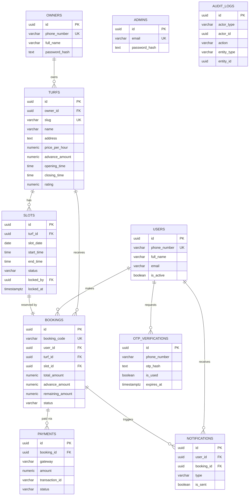

# ER Diagram — RMS Futsal Booking Platform

### Key relationships
- **One owner → many turfs** (already modeled, even though only 1 turf exists today).
- **One turf → many slots**, one row per bookable hour per date. Slots are
  generated by a scheduled job that keeps a rolling 3-day window populated.
- **One slot → at most one active booking** — enforced at the application layer
  via the locking flow (see `booking_service.py`) and at the DB layer via the
  `UNIQUE (turf_id, slot_date, start_time)` constraint on `slots`.
- **One booking → one or more payment attempts** (a failed eSewa attempt
  followed by a successful Khalti retry both live in `payments`, so the audit
  trail is never lost).
